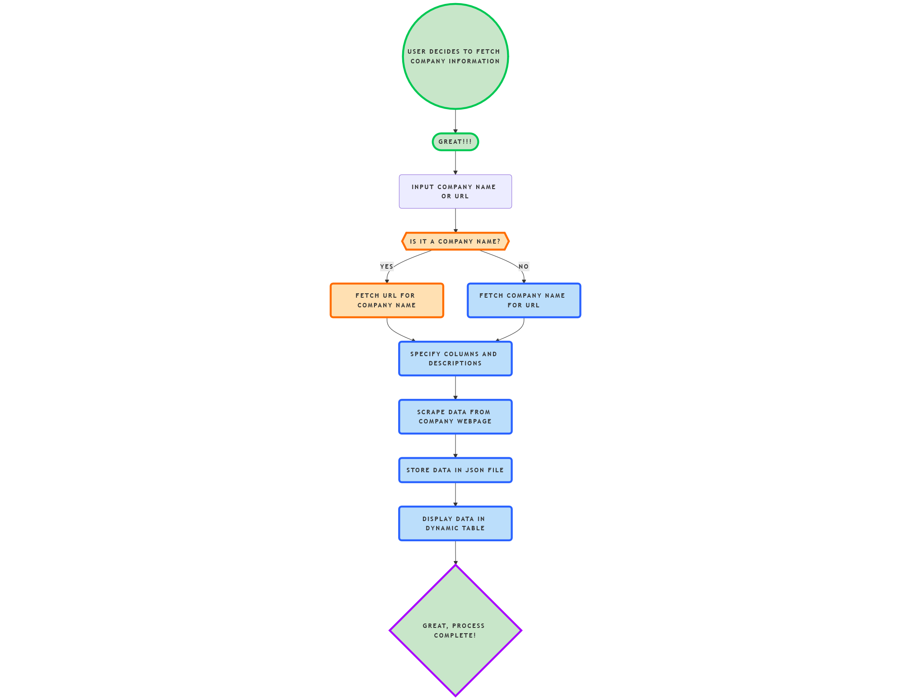
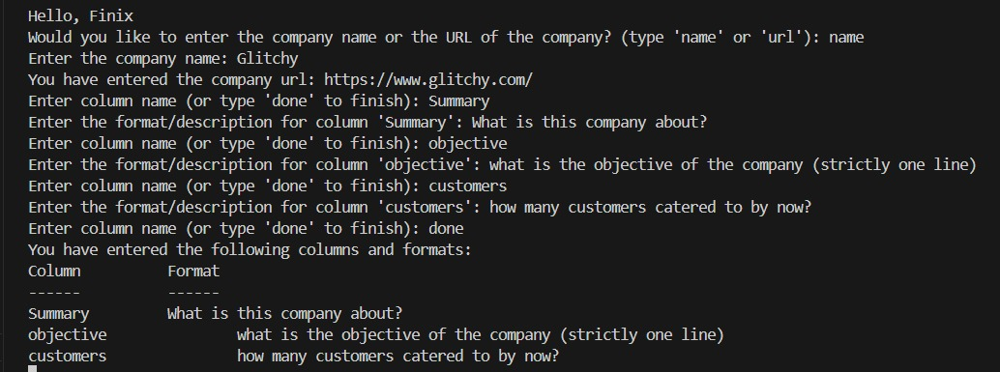
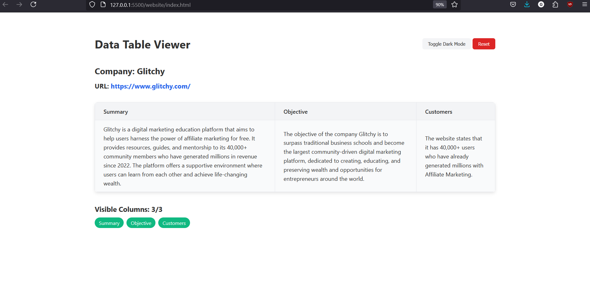

# Cohesive Ai
(An Attempt to create a lightweight version of Google's Cohesive Ai)
# 🗂️ Data Table Viewer & Scraper

A comprehensive **Data Table Viewer & Scraper** that fetches structured information from a company's website using a dynamic prompt system and presents the data through an interactive web interface.

all made possible with the help of [ScrapegraphAI](https://github.com/ScrapeGraphAI/Scrapegraph-ai)

## 📌 Overview

This project allows you to:

✅ **Input Company Name or URL**: Automatically fetch and extract information.  
✅ **Dynamic Column Configuration**: Customize the columns and their formats for content extraction.  
✅ **Intelligent Scraping**: Extracts structured content from company websites using custom prompts.  
✅ **Interactive Data Display**: Presents the extracted data through a modern **Data Table Viewer**.  
✅ **Dark Mode Toggle**: Seamlessly switch between **light** and **dark** themes.  

---

## 📊 JSON Output Structure

The extracted data is stored in a `data.json` file in the following format:

```json
{
    "company": {
        "name": "Goldman Sachs",
        "url": "https://www.goldmansachs.com/"
    },
    "columns": ["Summary", "Objective"],
    "data": {
        "Summary": {
            "content": "Goldman Sachs is a leading global investment bank and financial services company..."
        },
        "Objective": {
            "content": "Our goal is to provide superior returns to our shareholders."
        }
    }
}
```
## 🚀 How It Works

1. **User Input**:  
   - Choose between **Company Name** or **Company URL**.  
   - Define the **columns** and their expected **formats** for content extraction.  

2. **Data Extraction**:  
   - The program intelligently scrapes data from the company's website.  
   - Extracted information is stored in `data.json`.  

3. **Web Interface**:  
   - Displays the extracted data dynamically in a table.  
   - Supports **dark mode** and **column management**.  

---

## 🛠️ Installation & Setup

### 1. Clone the Repository:

```bash
git clone https://github.com/your-username/data-table-viewer-scraper.git
cd data-table-viewer-scraper
```
## 2. 📦 Set Up a Virtual Environment

It is recommended to use a virtual environment to manage dependencies.

### 🐍 For Windows:

1. Create a virtual environment:

    ```bash
    python -m venv venv
    ```

2. Activate the virtual environment:

    ```bash
    venv\Scripts\activate
    ```

3. Deactivate the virtual environment (when done):

    ```bash
    deactivate
    ```

---

### 🐧 For Linux/Mac:

1. Create a virtual environment:

    ```bash
    python3 -m venv venv
    ```

2. Activate the virtual environment:

    ```bash
    source venv/bin/activate
    ```

3. Deactivate the virtual environment (when done):

    ```bash
    deactivate
    ```

---

✅ **Now you are ready to install project dependencies and run the application!**

### 3. Install Dependencies:

Ensure you have Python and required modules installed.

```bash
pip install -r requirements.txt
```

### 4. Run the Application:

```bash
python main.py
```
---

## 📂 Project Structure

```
├── modules/                 # Modularized code for better structure
│    ├── content_fetch.py    # Scrape content from the website
│    ├── info_fetch.py       # Extract structured information
│    ├── get_url_name.py     # Fetch company name & URL from search
│    └── server.py           # Starts a local web server
│
├── website/
│    ├── index.html          # Main HTML interface
│    ├── styles.css          # Styling for light/dark modes
|    ├── data.json           # Extracted output
│    └── script.js           # Dynamic JS for UI interactions
│
├── main.py                  # Main flow and logic
└── requirements.txt         # Python dependencies
```

---

## 📜 Main Workflow (from `main.py`)


---

## 🔥 Key Modules

### 1. **`content_fetch.py`**:  
Handles content scraping with custom prompts.

### 2. **`info_fetch.py`**:  
Extracts and structures information.

### 3. **`get_url_name.py`**:  
Fetches the company name and URL from a search.

### 4. **`server.py`**:  
Launches a simple web server to display the data.

---
## Webpage display




## 🎯 Future Improvements (TODO)

- [ ] Add support for multiple companies/urls
- [ ] Improve multi-page content extraction.  
- [ ] Improve error handling for better user experience.  

---

## 🤝 Contribution Guidelines

We welcome contributions! To contribute:

1. **Fork** the repository.  
2. **Create** a new branch.  
3. **Submit** a Pull Request (PR).  

---

⭐ **If you found this project helpful, consider giving it a star!**  
```